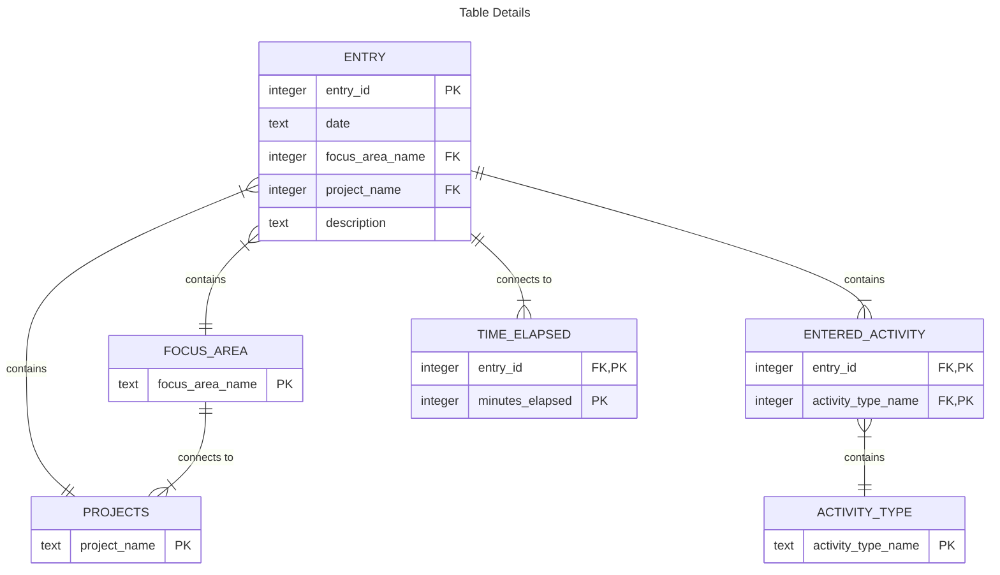

```mermaid
---
title: Table Details

---
erDiagram
    ENTRY |{--|| FOCUS_AREA : contains 
    ENTRY {
        integer entry_id PK
        text date
        integer focus_area_name FK
        integer project_name FK
        text description
    }
    FOCUS_AREA {
        text focus_area_name PK
    }
    ENTRY |{--|| PROJECTS : contains
    PROJECTS {
        text project_name PK
    
    }

    ENTRY ||--|{ ENTERED_ACTIVITY  : contains
    ENTERED_ACTIVITY|{--|| ACTIVITY_TYPE  : contains
    ENTERED_ACTIVITY {
        integer entry_id FK, PK
        integer activity_type_name FK, PK
    }
    ACTIVITY_TYPE {
        text activity_type_name PK
    }

    ENTRY ||--|{ TIME_ELAPSED : "connects to"
    TIME_ELAPSED {
        integer entry_id FK,PK
        integer minutes_elapsed PK
    }

    FOCUS_AREA|| -- |{PROJECTS : "connects to"

```

[comment] : ENTERED_ACTIVITY, a composite entity, must be updated to reflect that an entry has an activity 